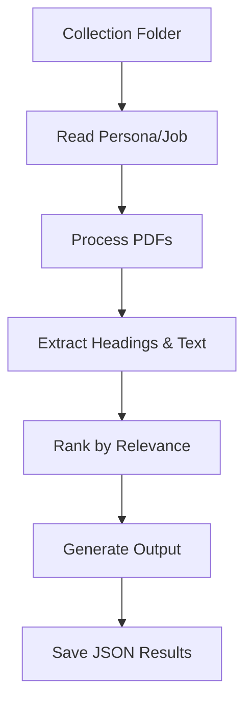

# Round 1B Persona-Driven Document Intelligence System

## Overview
This solution addresses Adobe India Hackathon 2025 Round 1B:  
**"Connect What Matters - For the User Who Matters"**.  
It’s an intelligent document analyst that extracts and prioritizes relevant sections from PDF collections based on specific personas and their tasks.

---

## Approach

### 🔍 Core Methodology

#### Persona Contextualization
- Combines persona role and job-to-be-done into a semantic query
- Uses **TF-IDF vectorization** to measure content relevance
- Prioritizes sections that best match the persona’s needs

#### Hierarchical Content Analysis
- **Section Extraction**: Identifies headings and their hierarchy
- **Content Relevance**: Ranks sections by persona-task relevance
- **Granular Insights**: Extracts key sentences from top sections

#### Efficiency Optimizations
- Lightweight text processing (no large models)
- Efficient PDF parsing with PyMuPDF
- CPU-optimized operations

---

## 🛠️ Processing Pipeline



---

## 📚 Models and Libraries Used

### Core Libraries

| Library        | Version | Purpose                                      |
|----------------|---------|----------------------------------------------|
| PyMuPDF        | 1.24.4  | PDF text extraction and structure analysis   |
| scikit-learn   | 1.3.0   | TF-IDF vectorization, cosine similarity      |
| NLTK           | 3.8.1   | Tokenization and stopword filtering          |
| NumPy          | 1.24.3  | Numerical operations and matrix handling     |

---

## 🧠 Natural Language Processing

- **TF-IDF Vectorization**: For semantic similarity
- **NLTK Resources**:
  - Punkt Tokenizer
  - Stopwords
- **Text Preprocessing**:
  - Lowercasing
  - Special character removal
  - Stopword elimination
  - Tokenization

---

## 🧰 System Requirements

- Python 3.9+
- Docker
- CPU-only (no GPU)
- Model size ≤ 0 MB
- RAM ≥ 16 GB

---

## 📁 Directory Structure

```
Challenge_1b/
├── Collection 1 - Travel Planning/
│   ├── PDFs/
│   ├── challenge1b_input.json
│   └── challenge1b_output.json
├── Collection 2 - Adobe Acrobat Learning/
│   ├── PDFs/
│   ├── challenge1b_input.json
│   └── challenge1b_output.json
└── ...
```

---

## 🚀 How to Build and Run

### 1. 🔧 Local Execution (Development)

#### Prerequisites

```powershell
pip install pymupdf scikit-learn nltk numpy
python -c "import nltk; nltk.download('punkt'); nltk.download('stopwords')"
```

#### Running

```powershell
# Create input config
@'
{
  "persona": "Travel Planner",
  "job_to_be_done": "Plan a 4-day trip for 10 college friends to South of France"
}
'@ | Set-Content ".\Challenge_1b\Collection 1\challenge1b_input.json"

# Place PDFs in Collection 1\PDFs\
Copy-Item "path\to\*.pdf" ".\Challenge_1b\Collection 1\PDFs\"

# Run
python persona_document_analyzer.py
```

---

### 2. 🐳 Docker Execution (Production)

#### Build Docker Image

```powershell
docker build --platform linux/amd64 -t persona-doc-analyzer .
```

#### Run Container

```powershell
docker run --rm `
  -v ${PWD}/Challenge_1b:/app/Challenge_1b `
  --network none `
  persona-doc-analyzer
```

#### Expected Execution (Hackathon Format)

```bash
docker run --rm   -v ${pwd}/input:/app/input   -v ${pwd}/output:/app/output   --network none   mysolutionname:somerandomidentifier
```

---

## ✅ Output Validation

Check `challenge1b_output.json` in each collection folder:

- ✅ Metadata (persona, job, timestamp)
- ✅ Top 5 relevant sections
- ✅ Top 5 key sentences

---

## 💡 Solution Features

- Persona-driven relevance detection
- Cross-document analysis
- Handles 3–10 PDFs in < 60 seconds
- Offline, CPU-only operation
- JSON output as per competition spec

---

## 📌 Constraints Compliance

| Constraint           | Status         |
|----------------------|----------------|
| CPU-only             | ✅ No GPU used |
| Model size           | ✅ 0 MB         |
| Internet access      | ✅ Offline      |
| Runtime              | ✅ < 60s        |
| Platform             | ✅ AMD64        |

---

## 📦 Test Case Examples

| Domain            | Persona             | Task Description                                 |
|------------------|----------------------|--------------------------------------------------|
| Travel Planning  | Travel Planner       | Plan trip to South of France                     |
| Business         | Investment Analyst   | Extract revenue trends from annual reports       |
| Education        | Chemistry Student    | Identify key concepts for exam prep              |

---

## 🧯 Troubleshooting

- ❌ PDFs missing → Ensure correct folder (`Collection X/PDFs`)
- ❌ NLTK error → Ensure `punkt` and `stopwords` are downloaded
- ❌ FileNotFoundError → Check volume mounts and relative paths
- ❌ Invalid output → Validate JSON against format

---

## 🚀 Competition Submission

- ✅ Git Repo (private)
- ✅ Dockerfile
- ✅ README (this file)
- ✅ Full Codebase in `persona_document_analyzer.py`

